Statistical Analysis
================

- [The Data](#the-data)
- [Descriptive Statistics](#descriptive-statistics)
- [Analysis 1: Linear Mixed Model](#analysis-1-linear-mixed-model)
  - [Diagnostics](#diagnostics)
  - [Post-Hoc: Filter vs Tissue](#post-hoc-filter-vs-tissue)
  - [Post-Hoc: Time Point Comparisons](#post-hoc-time-point-comparisons)
  - [Likelihood Ratio Tests](#likelihood-ratio-tests)
  - [Sensitivity: Random Slope for
    Type](#sensitivity-random-slope-for-type)
  - [Per-Type Linear Models](#per-type-linear-models)
  - [Figure 1: Filter vs Tissue DNA
    Yield](#figure-1-filter-vs-tissue-dna-yield)
  - [Figure 2: DNA Yield Over Storage
    Time](#figure-2-dna-yield-over-storage-time)
- [Analysis 2: Fish Weight Loss Predicts Filter DNA
  Yield](#analysis-2-fish-weight-loss-predicts-filter-dna-yield)
  - [Figure 3: Weight Loss vs Filter DNA
    Yield](#figure-3-weight-loss-vs-filter-dna-yield)
- [Analysis 3: Initial Fish Weight Predicts Weight
  Loss](#analysis-3-initial-fish-weight-predicts-weight-loss)
  - [Figure 4: Initial Weight vs Weight
    Loss](#figure-4-initial-weight-vs-weight-loss)

``` r
library(dplyr)
library(ggplot2)
library(ggpubr)
library(ggpmisc)
library(scales)
library(lme4)
library(lmerTest)
library(emmeans)
library(DHARMa)
library(performance)
library(magick)
```

# The Data

``` r
data.dir <- "."
fig.dir  <- file.path(data.dir, "Figures")
dir.create(fig.dir, showWarnings = FALSE)

data <- read.delim(file.path(data.dir, "data_paired_raw.txt")) %>%
  mutate(
    ID          = factor(ID),
    type        = factor(type, levels = c("filter", "tissue")),
    temperature = factor(temperature, levels = c("room", "fridge")),
    time.hours  = as.numeric(time),
    log.conc    = log10(concentration)
  )

data.filter <- read.delim(file.path(data.dir, "data_filter.txt")) %>%
  mutate(
    ID          = factor(ID),
    temperature = factor(temperature, levels = c("room", "fridge")),
    time.hours  = as.numeric(time),
    labels      = factor(labels)
  )
```

# Descriptive Statistics

``` r
data %>%
  group_by(type, time.hours, temperature) %>%
  summarise(
    n    = n(),
    Mean = round(mean(concentration), 1),
    SD   = round(sd(concentration), 1),
    .groups = "drop"
  ) %>%
  arrange(type, desc(time.hours)) %>%
  knitr::kable(
    col.names = c("Type", "Time (h)", "Temp", "n", "Mean", "SD"),
    caption   = "DNA concentration (ng/uL) by group"
  )
```

| Type   | Time (h) | Temp   |   n |  Mean |    SD |
|:-------|---------:|:-------|----:|------:|------:|
| filter |      672 | room   |   4 |   8.8 |  13.1 |
| filter |      672 | fridge |   4 |  14.7 |  15.3 |
| filter |      336 | room   |   4 |  28.2 |  16.1 |
| filter |      336 | fridge |   4 |   3.0 |   2.2 |
| filter |      168 | room   |   4 |  53.7 |  54.2 |
| filter |      168 | fridge |   4 |  26.5 |  29.6 |
| filter |       72 | room   |   4 |  24.4 |  29.8 |
| filter |       72 | fridge |   4 |  16.8 |  27.1 |
| filter |       24 | room   |   4 |  31.3 |  11.4 |
| filter |       24 | fridge |   4 |  39.5 |  42.7 |
| tissue |      672 | room   |   4 |  44.2 |  24.5 |
| tissue |      672 | fridge |   4 |  55.5 |  15.5 |
| tissue |      336 | room   |   4 | 228.0 |  41.7 |
| tissue |      336 | fridge |   4 | 274.5 | 113.7 |
| tissue |      168 | room   |   4 | 120.8 |  93.4 |
| tissue |      168 | fridge |   4 | 276.5 | 143.5 |
| tissue |       72 | room   |   4 | 150.8 |  51.1 |
| tissue |       72 | fridge |   4 | 145.1 | 127.1 |
| tissue |       24 | room   |   4 |  82.8 |  23.8 |
| tissue |       24 | fridge |   4 | 254.2 |  86.6 |

DNA concentration (ng/uL) by group

``` r
data %>%
  group_by(type) %>%
  summarise(
    Min      = round(min(concentration), 2),
    Max      = round(max(concentration), 1),
    Below.1  = sum(concentration <  1),
    Below.10 = sum(concentration < 10),
    .groups  = "drop"
  )
```

    ## # A tibble: 2 × 5
    ##   type     Min   Max Below.1 Below.10
    ##   <fct>  <dbl> <dbl>   <int>    <int>
    ## 1 filter  0.11   128       4       17
    ## 2 tissue 17.3    419       0        0

# Analysis 1: Linear Mixed Model

``` r
model <- lmer(
  log.conc ~ type * time.hours +
             type * temperature +
             time.hours:temperature +
             (1 | ID),
  data = data,
  REML = TRUE
)

anova(model, ddf = "Kenward-Roger")
```

    ## Type III Analysis of Variance Table with Kenward-Roger's method
    ##                         Sum Sq Mean Sq NumDF DenDF F value    Pr(>F)    
    ## type                   11.0537 11.0537     1    37 43.2560 1.045e-07 ***
    ## time.hours              1.4413  1.4413     1    36  5.6403    0.0230 *  
    ## temperature             0.2674  0.2674     1    36  1.0463    0.3132    
    ## type:time.hours         0.0001  0.0001     1    37  0.0005    0.9819    
    ## type:temperature        1.8169  1.8169     1    37  7.1099    0.0113 *  
    ## time.hours:temperature  0.0990  0.0990     1    36  0.3873    0.5376    
    ## ---
    ## Signif. codes:  0 '***' 0.001 '**' 0.01 '*' 0.05 '.' 0.1 ' ' 1

``` r
summary(model)
```

    ## Linear mixed model fit by REML. t-tests use Satterthwaite's method [
    ## lmerModLmerTest]
    ## Formula: 
    ## log.conc ~ type * time.hours + type * temperature + time.hours:temperature +  
    ##     (1 | ID)
    ##    Data: data
    ## 
    ## REML criterion at convergence: 173.3
    ## 
    ## Scaled residuals: 
    ##      Min       1Q   Median       3Q      Max 
    ## -3.04892 -0.47640  0.02714  0.62570  1.89271 
    ## 
    ## Random effects:
    ##  Groups   Name        Variance Std.Dev.
    ##  ID       (Intercept) 0.04396  0.2097  
    ##  Residual             0.25554  0.5055  
    ## Number of obs: 80, groups:  ID, 40
    ## 
    ## Fixed effects:
    ##                                Estimate Std. Error         df t value Pr(>|t|)
    ## (Intercept)                   1.413e+00  1.698e-01  6.660e+01   8.317 6.72e-12
    ## typetissue                    7.956e-01  2.015e-01  3.700e+01   3.949 0.000339
    ## time.hours                   -8.431e-04  4.629e-04  5.973e+01  -1.821 0.073579
    ## temperaturefridge            -4.992e-01  2.240e-01  5.820e+01  -2.229 0.029707
    ## typetissue:time.hours         1.098e-05  4.821e-04  3.700e+01   0.023 0.981947
    ## typetissue:temperaturefridge  6.028e-01  2.261e-01  3.700e+01   2.666 0.011301
    ## time.hours:temperaturefridge  3.478e-04  5.589e-04  3.600e+01   0.622 0.537642
    ##                                 
    ## (Intercept)                  ***
    ## typetissue                   ***
    ## time.hours                   .  
    ## temperaturefridge            *  
    ## typetissue:time.hours           
    ## typetissue:temperaturefridge *  
    ## time.hours:temperaturefridge    
    ## ---
    ## Signif. codes:  0 '***' 0.001 '**' 0.01 '*' 0.05 '.' 0.1 ' ' 1
    ## 
    ## Correlation of Fixed Effects:
    ##             (Intr) typtss tm.hrs tmprtr typt:. typts:
    ## typetissue  -0.593                                   
    ## time.hours  -0.693  0.317                            
    ## temprtrfrdg -0.659  0.283  0.383                     
    ## typtss:tm.h  0.361 -0.609 -0.521  0.000              
    ## typtss:tmpr  0.333 -0.561  0.000 -0.505  0.000       
    ## tm.hrs:tmpr  0.419  0.000 -0.604 -0.635  0.000  0.000

``` r
r2_nakagawa(model)
```

    ## # R2 for Mixed Models
    ## 
    ##   Conditional R2: 0.612
    ##      Marginal R2: 0.545

## Diagnostics

``` r
sim <- simulateResiduals(model, n = 1000)
plot(sim)
```

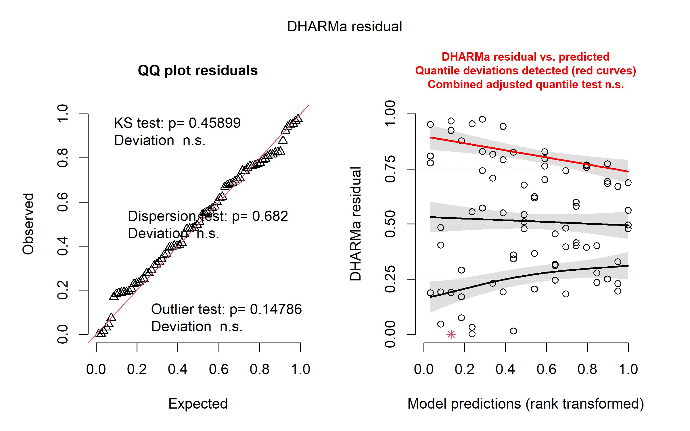<!-- -->

``` r
png(
  file.path(fig.dir, "Diagnostic_DHARMa.png"),
  width = 8, height = 5, units = "in", res = 300
)
plot(sim)
dev.off()
```

    ## png 
    ##   2

``` r
cairo_pdf(
  file.path(fig.dir, "Diagnostic_DHARMa.pdf"),
  width = 8, height = 5
)
plot(sim)
dev.off()
```

    ## png 
    ##   2

``` r
shapiro.test(residuals(model))
```

    ## 
    ##  Shapiro-Wilk normality test
    ## 
    ## data:  residuals(model)
    ## W = 0.97036, p-value = 0.05982

``` r
testUniformity(sim)
```

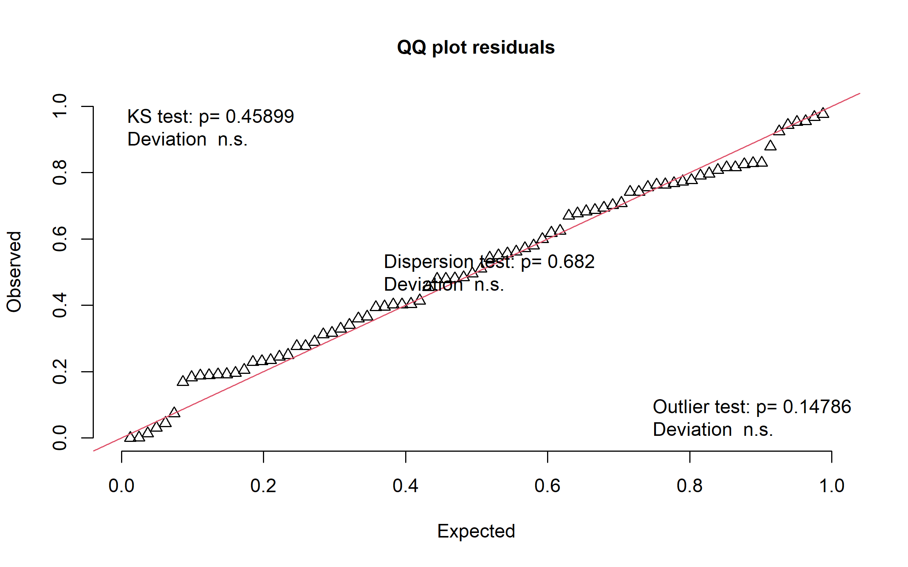<!-- -->

    ## 
    ##  Asymptotic one-sample Kolmogorov-Smirnov test
    ## 
    ## data:  simulationOutput$scaledResiduals
    ## D = 0.0955, p-value = 0.459
    ## alternative hypothesis: two-sided

``` r
testDispersion(sim)
```

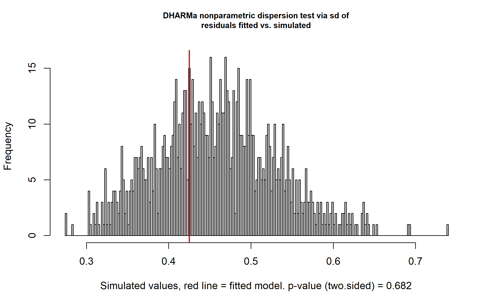<!-- -->

    ## 
    ##  DHARMa nonparametric dispersion test via sd of residuals fitted vs.
    ##  simulated
    ## 
    ## data:  simulationOutput
    ## dispersion = 0.92794, p-value = 0.682
    ## alternative hypothesis: two.sided

## Post-Hoc: Filter vs Tissue

``` r
contrast.results <- pairs(emmeans(model, ~ type))
contrast.results
```

    ##  contrast        estimate    SE df t.ratio p.value
    ##  filter - tissue     -1.1 0.113 37  -9.729 <0.0001
    ## 
    ## Results are averaged over the levels of: temperature 
    ## Degrees-of-freedom method: kenward-roger

``` r
fold.change <- round(10 ^ abs(as.data.frame(contrast.results)$estimate), 1)
paste0("Tissue yields ~", fold.change, "x more DNA than filter (geometric mean ratio)")
```

    ## [1] "Tissue yields ~12.6x more DNA than filter (geometric mean ratio)"

## Post-Hoc: Time Point Comparisons

``` r
data$time.factor <- factor(data$time.hours)

model.time <- lmer(
  log.conc ~ type * time.factor +
             type * temperature +
             (1 | ID),
  data = data,
  REML = TRUE
)

anova(model.time, ddf = "Kenward-Roger")
```

    ## Type III Analysis of Variance Table with Kenward-Roger's method
    ##                   Sum Sq Mean Sq NumDF DenDF  F value   Pr(>F)    
    ## type             24.1899 24.1899     1    34 107.6342 4.51e-12 ***
    ## time.factor       2.3484  0.5871     4    34   2.6124 0.052489 .  
    ## temperature       0.1654  0.1654     1    34   0.7358 0.397016    
    ## type:time.factor  1.8140  0.4535     4    34   2.0179 0.114003    
    ## type:temperature  1.8169  1.8169     1    34   8.0844 0.007502 ** 
    ## ---
    ## Signif. codes:  0 '***' 0.001 '**' 0.01 '*' 0.05 '.' 0.1 ' ' 1

``` r
emm.time <- emmeans(model.time, ~ time.factor)
emm.time
```

    ##  time.factor emmean    SE df lower.CL upper.CL
    ##  24            1.80 0.142 34    1.511     2.09
    ##  72            1.43 0.142 34    1.137     1.72
    ##  168           1.66 0.142 34    1.373     1.95
    ##  336           1.62 0.142 34    1.326     1.91
    ##  672           1.21 0.142 34    0.918     1.50
    ## 
    ## Results are averaged over the levels of: type, temperature 
    ## Degrees-of-freedom method: kenward-roger 
    ## Confidence level used: 0.95

``` r
pairs(emm.time, adjust = "tukey")
```

    ##  contrast                        estimate    SE df t.ratio p.value
    ##  time.factor24 - time.factor72     0.3749 0.201 34   1.861  0.3572
    ##  time.factor24 - time.factor168    0.1384 0.201 34   0.687  0.9580
    ##  time.factor24 - time.factor336    0.1852 0.201 34   0.919  0.8875
    ##  time.factor24 - time.factor672    0.5930 0.201 34   2.943  0.0431
    ##  time.factor72 - time.factor168   -0.2366 0.201 34  -1.174  0.7658
    ##  time.factor72 - time.factor336   -0.1897 0.201 34  -0.941  0.8786
    ##  time.factor72 - time.factor672    0.2181 0.201 34   1.083  0.8141
    ##  time.factor168 - time.factor336   0.0469 0.201 34   0.233  0.9993
    ##  time.factor168 - time.factor672   0.4547 0.201 34   2.257  0.1840
    ##  time.factor336 - time.factor672   0.4078 0.201 34   2.024  0.2766
    ## 
    ## Results are averaged over the levels of: type, temperature 
    ## Degrees-of-freedom method: kenward-roger 
    ## P value adjustment: tukey method for comparing a family of 5 estimates

## Likelihood Ratio Tests

``` r
model.full <- lmer(
  log.conc ~ type * time.hours +
             type * temperature +
             time.hours:temperature +
             (1 | ID),
  data = data,
  REML = FALSE
)

model.no.type <- lmer(
  log.conc ~ time.hours + temperature + time.hours:temperature + (1 | ID),
  data = data, REML = FALSE
)
anova(model.no.type, model.full)
```

    ## Data: data
    ## Models:
    ## model.no.type: log.conc ~ time.hours + temperature + time.hours:temperature + (1 | ID)
    ## model.full: log.conc ~ type * time.hours + type * temperature + time.hours:temperature + (1 | ID)
    ##               npar    AIC    BIC  logLik -2*log(L)  Chisq Df Pr(>Chisq)    
    ## model.no.type    6 197.87 212.17 -92.937    185.87                         
    ## model.full       9 140.38 161.81 -61.188    122.38 63.499  3   1.05e-13 ***
    ## ---
    ## Signif. codes:  0 '***' 0.001 '**' 0.01 '*' 0.05 '.' 0.1 ' ' 1

``` r
model.no.time <- lmer(
  log.conc ~ type + temperature + type:temperature + (1 | ID),
  data = data, REML = FALSE
)
anova(model.no.time, model.full)
```

    ## Data: data
    ## Models:
    ## model.no.time: log.conc ~ type + temperature + type:temperature + (1 | ID)
    ## model.full: log.conc ~ type * time.hours + type * temperature + time.hours:temperature + (1 | ID)
    ##               npar    AIC    BIC  logLik -2*log(L)  Chisq Df Pr(>Chisq)
    ## model.no.time    6 140.57 154.86 -64.284    128.57                     
    ## model.full       9 140.38 161.81 -61.188    122.38 6.1928  3     0.1026

``` r
model.no.temp <- lmer(
  log.conc ~ type + time.hours + type:time.hours + (1 | ID),
  data = data, REML = FALSE
)
anova(model.no.temp, model.full)
```

    ## Data: data
    ## Models:
    ## model.no.temp: log.conc ~ type + time.hours + type:time.hours + (1 | ID)
    ## model.full: log.conc ~ type * time.hours + type * temperature + time.hours:temperature + (1 | ID)
    ##               npar    AIC    BIC  logLik -2*log(L)  Chisq Df Pr(>Chisq)  
    ## model.no.temp    6 142.59 156.88 -65.296    130.59                       
    ## model.full       9 140.38 161.81 -61.188    122.38 8.2163  3    0.04175 *
    ## ---
    ## Signif. codes:  0 '***' 0.001 '**' 0.01 '*' 0.05 '.' 0.1 ' ' 1

``` r
model.no.typetime <- lmer(
  log.conc ~ type + time.hours + temperature +
             type:temperature + time.hours:temperature +
             (1 | ID),
  data = data, REML = FALSE
)
anova(model.no.typetime, model.full)
```

    ## Data: data
    ## Models:
    ## model.no.typetime: log.conc ~ type + time.hours + temperature + type:temperature + time.hours:temperature + (1 | ID)
    ## model.full: log.conc ~ type * time.hours + type * temperature + time.hours:temperature + (1 | ID)
    ##                   npar    AIC    BIC  logLik -2*log(L) Chisq Df Pr(>Chisq)
    ## model.no.typetime    8 138.38 157.43 -61.188    122.38                    
    ## model.full           9 140.38 161.81 -61.188    122.38 6e-04  1     0.9811

## Sensitivity: Random Slope for Type

``` r
model.slope <- lmer(
  log.conc ~ type * time.hours + type * temperature +
             time.hours:temperature + (0 + type | ID),
  data = data, REML = TRUE,
  control = lmerControl(check.nobs.vs.nRE = "ignore")
)

anova(model.slope, ddf = "Kenward-Roger")
```

    ## Type III Analysis of Variance Table with Kenward-Roger's method
    ##                         Sum Sq Mean Sq NumDF  DenDF F value    Pr(>F)    
    ## type                   2.82709 2.82709     1 37.000 43.2556 1.045e-07 ***
    ## time.hours             0.36673 0.36673     1 36.231  5.6111    0.0233 *  
    ## temperature            0.01512 0.01512     1 46.793  0.2314    0.6328    
    ## type:time.hours        0.00003 0.00003     1 37.000  0.0005    0.9819    
    ## type:temperature       0.46469 0.46469     1 37.000  7.1099    0.0113 *  
    ## time.hours:temperature 0.00478 0.00478     1 36.000  0.0731    0.7884    
    ## ---
    ## Signif. codes:  0 '***' 0.001 '**' 0.01 '*' 0.05 '.' 0.1 ' ' 1

``` r
pairs(emmeans(model.slope, ~ type))
```

    ##  contrast        estimate    SE df t.ratio p.value
    ##  filter - tissue     -1.1 0.113 37  -9.729 <0.0001
    ## 
    ## Results are averaged over the levels of: temperature 
    ## Degrees-of-freedom method: kenward-roger

``` r
AIC(model, model.slope)
```

    ##             df      AIC
    ## model        9 191.3109
    ## model.slope 11 171.5594

## Per-Type Linear Models

``` r
data.filter.only <- data %>% filter(type == "filter")
data.tissue.only <- data %>% filter(type == "tissue")

model.filter <- lm(log.conc ~ time.hours * temperature, data = data.filter.only)
summary(model.filter)
```

    ## 
    ## Call:
    ## lm(formula = log.conc ~ time.hours * temperature, data = data.filter.only)
    ## 
    ## Residuals:
    ##      Min       1Q   Median       3Q      Max 
    ## -1.77681 -0.40275  0.01309  0.47368  1.17665 
    ## 
    ## Coefficients:
    ##                                Estimate Std. Error t value Pr(>|t|)    
    ## (Intercept)                   1.4847538  0.2339905   6.345 2.41e-07 ***
    ## time.hours                   -0.0011267  0.0006763  -1.666   0.1044    
    ## temperaturefridge            -0.6434891  0.3309126  -1.945   0.0597 .  
    ## time.hours:temperaturefridge  0.0009150  0.0009565   0.957   0.3451    
    ## ---
    ## Signif. codes:  0 '***' 0.001 '**' 0.01 '*' 0.05 '.' 0.1 ' ' 1
    ## 
    ## Residual standard error: 0.7092 on 36 degrees of freedom
    ## Multiple R-squared:  0.1475, Adjusted R-squared:  0.07642 
    ## F-statistic: 2.076 on 3 and 36 DF,  p-value: 0.1206

``` r
model.tissue <- lm(log.conc ~ time.hours * temperature, data = data.tissue.only)
summary(model.tissue)
```

    ## 
    ## Call:
    ## lm(formula = log.conc ~ time.hours * temperature, data = data.tissue.only)
    ## 
    ## Residuals:
    ##      Min       1Q   Median       3Q      Max 
    ## -0.53069 -0.23722 -0.02099  0.22721  0.49231 
    ## 
    ## Coefficients:
    ##                                Estimate Std. Error t value Pr(>|t|)    
    ## (Intercept)                   2.1360341  0.1008035  21.190   <2e-16 ***
    ## time.hours                   -0.0005485  0.0002914  -1.883   0.0679 .  
    ## temperaturefridge             0.2479034  0.1425577   1.739   0.0906 .  
    ## time.hours:temperaturefridge -0.0002193  0.0004121  -0.532   0.5978    
    ## ---
    ## Signif. codes:  0 '***' 0.001 '**' 0.01 '*' 0.05 '.' 0.1 ' ' 1
    ## 
    ## Residual standard error: 0.3055 on 36 degrees of freedom
    ## Multiple R-squared:  0.2863, Adjusted R-squared:  0.2269 
    ## F-statistic: 4.814 on 3 and 36 DF,  p-value: 0.006406

## Figure 1: Filter vs Tissue DNA Yield

``` r
filter.log <- data$log.conc[data$type == "filter"]
tissue.log <- data$log.conc[data$type == "tissue"]
ttest.log <- t.test(filter.log, tissue.log, paired = TRUE)
pval.label <- ifelse(ttest.log$p.value < 0.001,
                     paste0("p = ", formatC(ttest.log$p.value, format = "e", digits = 1)),
                     paste0("p = ", round(ttest.log$p.value, 4)))

fig1a <- ggboxplot(data, x = "type", y = "concentration",
                   fill = "type", palette = c("#00A08A", "#F2635F"),
                   add = "jitter", outlier.shape = NA) +
  scale_y_log10(labels = label_number(),
                breaks = c(0.1, 1, 10, 100, 1000),
                limits = c(0.08, 3000)) +
  annotate("text", x = 1.5, y = 2200,
           label = paste("Paired t-test (log10):", pval.label),
           size = 5.5, fontface = "bold") +
  labs(x = NULL, y = "DNA Concentration (ng/µL)") +
  theme_classic(base_size = 18) +
  theme(legend.position = "none",
        axis.title.y = element_text(face = "bold", size = 20,
                                    margin = margin(r = 8)),
        axis.text    = element_text(face = "bold", color = "black", size = 18),
        axis.line    = element_line(linewidth = 0.4, color = "black"),
        plot.margin  = margin(15, 20, 15, 15))

print(fig1a)
```

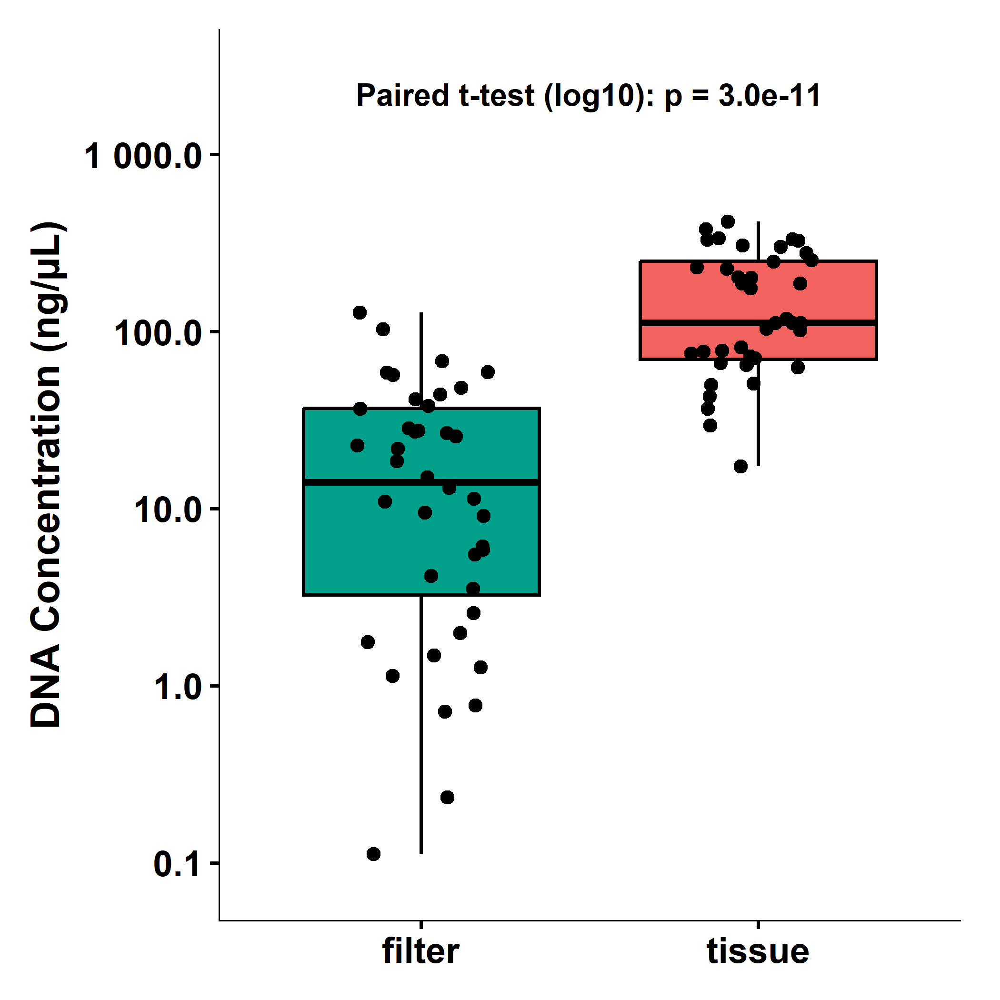<!-- -->

``` r
ggsave(file.path(fig.dir, "Figure_1a.png"), fig1a,
       width = 7, height = 7, dpi = 300, bg = "white")
ggsave(file.path(fig.dir, "Figure_1a.pdf"), fig1a,
       width = 7, height = 7, device = cairo_pdf, bg = "white")
```

``` r
fig1b <- ggpaired(data, x = "type", y = "concentration", id = "ID",
                  color = "type", line.color = "grey60", line.size = 0.4,
                  palette = c("#00A08A", "#F2635F"), point.size = 2.5) +
  scale_y_log10(labels = label_number(),
                breaks = c(0.1, 1, 10, 100, 1000),
                limits = c(0.08, 3000)) +
  labs(x = NULL, y = "DNA Concentration (ng/µL)") +
  theme_classic(base_size = 18) +
  theme(legend.position = "none",
        axis.title.y = element_text(face = "bold", size = 20,
                                    color = "transparent",
                                    margin = margin(r = 8)),
        axis.text    = element_text(face = "bold", color = "black", size = 18),
        axis.line    = element_line(linewidth = 0.4, color = "black"),
        plot.margin  = margin(15, 20, 15, 15))

print(fig1b)
```

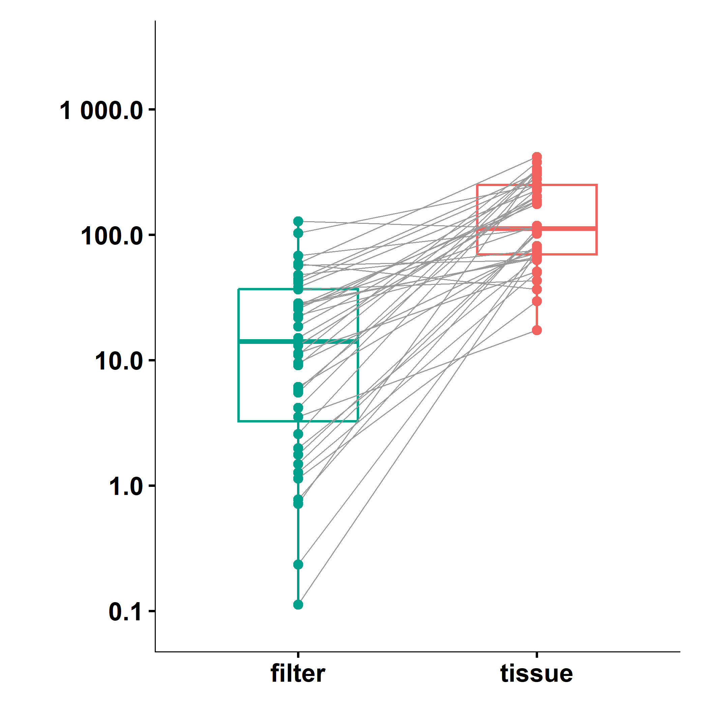<!-- -->

``` r
ggsave(file.path(fig.dir, "Figure_1b.png"), fig1b,
       width = 7, height = 7, dpi = 300, bg = "white")
ggsave(file.path(fig.dir, "Figure_1b.pdf"), fig1b,
       width = 7, height = 7, device = cairo_pdf, bg = "white")
```

``` r
img_a <- image_read(file.path(fig.dir, "Figure_1a.png"))
img_b <- image_read(file.path(fig.dir, "Figure_1b.png"))

target_h <- max(image_info(img_a)$height, image_info(img_b)$height)

img_a <- image_resize(img_a, paste0("x", target_h))
img_b <- image_resize(img_b, paste0("x", target_h))

img_a <- image_annotate(img_a, "A", location = "+40+20", size = 120,
                        weight = 700, color = "black")
img_b <- image_annotate(img_b, "B", location = "+40+20", size = 120,
                        weight = 700, color = "black")

fig1 <- image_append(c(img_a, img_b), stack = FALSE)

image_write(fig1, file.path(fig.dir, "Figure_1.png"), format = "png")
image_write(fig1, file.path(fig.dir, "Figure_1.pdf"), format = "pdf")

fig1
```

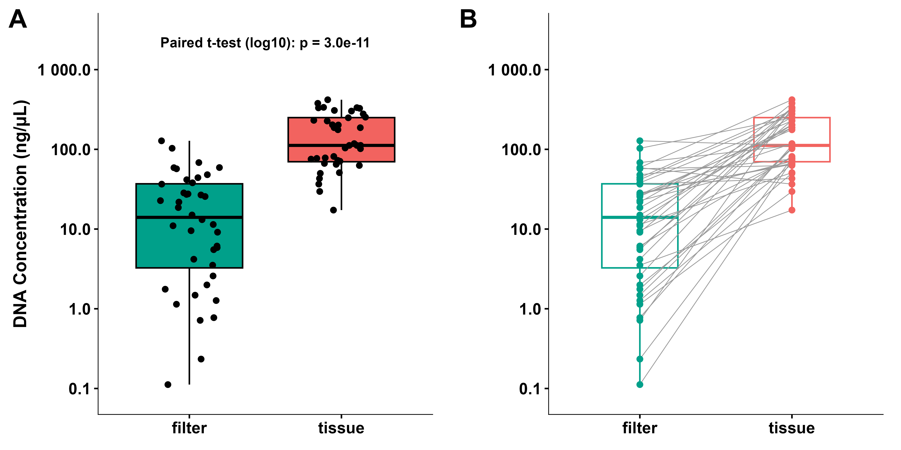

## Figure 2: DNA Yield Over Storage Time

``` r
fig2 <- ggplot(data, aes(x = time.hours, y = concentration,
                         color = temperature, fill = temperature)) +
  geom_smooth(method = "lm", alpha = 0.18, linewidth = 0.9, se = TRUE) +
  geom_point(shape = 21, color = "white", stroke = 0.4,
             size = 2.8, alpha = 0.95) +
  facet_wrap(~ type, labeller = as_labeller(
    c(filter = "Filter Extraction", tissue = "Tissue Extraction"))) +
  stat_poly_eq(data = ~ filter(.x, type == "filter"),
               aes(group = temperature, color = temperature,
                   label = paste(after_stat(rr.label),
                                 after_stat(p.value.label), sep = "*\", \"*")),
               formula = y ~ x,
               label.x = "left", label.y = c(0.97, 0.87),
               size = 3.6, parse = TRUE, label.size = NA) +
  stat_poly_eq(data = ~ filter(.x, type == "tissue"),
               aes(group = temperature, color = temperature,
                   label = paste(after_stat(rr.label),
                                 after_stat(p.value.label), sep = "*\", \"*")),
               formula = y ~ x,
               label.x = "left", label.y = c(0.12, 0.04),
               size = 3.6, parse = TRUE, label.size = NA) +
  scale_color_manual(values = c(room = "#D55E00", fridge = "#0072B2"),
                     labels = c("Room", "Fridge"),
                     name = "Temperature Treatment") +
  scale_fill_manual(values = c(room = "#D55E00", fridge = "#0072B2"),
                    labels = c("Room", "Fridge"),
                    name = "Temperature Treatment") +
  scale_y_log10(labels = label_number(),
                breaks = c(0.1, 1, 10, 100, 1000)) +
  scale_x_continuous(breaks = c(24, 72, 168, 336, 672),
                     labels = c("24", "72", "168", "336", "672")) +
  labs(x = "Duration of fixation (hours)",
       y = "DNA Concentration (ng/µL)") +
  theme_pubr() +
  theme(strip.background = element_rect(fill = "grey95", color = "grey60", linewidth = 0.4),
        strip.text = element_text(face = "bold", size = 12),
        legend.position = "top",
        legend.title = element_text(face = "bold"),
        axis.title = element_text(face = "bold"),
        panel.border = element_rect(color = "grey60", fill = NA, linewidth = 0.4))

print(fig2)
```

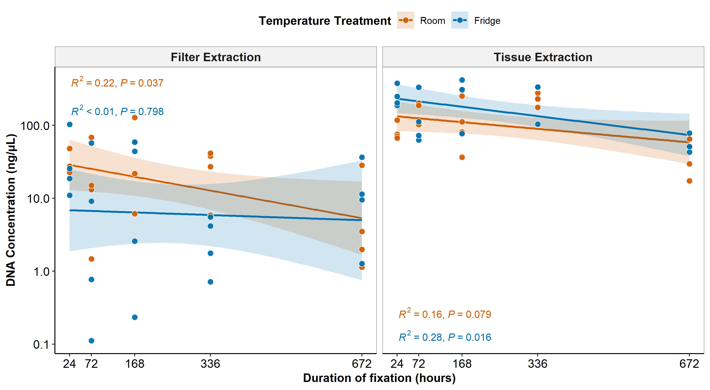<!-- -->

``` r
ggsave(file.path(fig.dir, "Figure_2.png"), fig2,
       width = 10, height = 5.5, dpi = 300, bg = "white")
ggsave(file.path(fig.dir, "Figure_2.pdf"), fig2,
       width = 10, height = 5.5, device = cairo_pdf, bg = "white")
```

# Analysis 2: Fish Weight Loss Predicts Filter DNA Yield

``` r
data.filter.complete <- data.filter %>% filter(!is.na(fishweightloss))
nrow(data.filter.complete)
```

    ## [1] 30

``` r
model2 <- lm(concentration ~ fishweightloss, data = data.filter.complete)
summary(model2)
```

    ## 
    ## Call:
    ## lm(formula = concentration ~ fishweightloss, data = data.filter.complete)
    ## 
    ## Residuals:
    ##     Min      1Q  Median      3Q     Max 
    ## -31.476 -15.316  -4.917   8.466  64.037 
    ## 
    ## Coefficients:
    ##                Estimate Std. Error t value Pr(>|t|)  
    ## (Intercept)      -4.106     13.185  -0.311   0.7578  
    ## fishweightloss   13.629      6.295   2.165   0.0391 *
    ## ---
    ## Signif. codes:  0 '***' 0.001 '**' 0.01 '*' 0.05 '.' 0.1 ' ' 1
    ## 
    ## Residual standard error: 23 on 28 degrees of freedom
    ## Multiple R-squared:  0.1434, Adjusted R-squared:  0.1128 
    ## F-statistic: 4.687 on 1 and 28 DF,  p-value: 0.03907

``` r
model2b <- lm(concentration ~ percentage, data = data.filter.complete)
summary(model2b)
```

    ## 
    ## Call:
    ## lm(formula = concentration ~ percentage, data = data.filter.complete)
    ## 
    ## Residuals:
    ##     Min      1Q  Median      3Q     Max 
    ## -25.432 -17.868  -9.022  16.454  80.218 
    ## 
    ## Coefficients:
    ##             Estimate Std. Error t value Pr(>|t|)
    ## (Intercept)  30.5858    20.1499   1.518     0.14
    ## percentage   -0.2279     0.5864  -0.389     0.70
    ## 
    ## Residual standard error: 24.78 on 28 degrees of freedom
    ## Multiple R-squared:  0.005368,   Adjusted R-squared:  -0.03015 
    ## F-statistic: 0.1511 on 1 and 28 DF,  p-value: 0.7004

## Figure 3: Weight Loss vs Filter DNA Yield

``` r
fig3 <- ggplot(data.filter.complete,
               aes(x = fishweightloss, y = concentration)) +
  geom_smooth(method = "lm", color = "grey20", fill = "grey75",
              alpha = 0.25, linewidth = 0.9) +
  geom_point(aes(fill = labels, shape = labels),
             color = "white", stroke = 0.4, size = 3.2, alpha = 0.95) +
  stat_poly_eq(aes(label = paste(after_stat(rr.label),
                                 after_stat(p.value.label), sep = "*\", \"*")),
               formula = y ~ x,
               label.x = "left", label.y = 0.97,
               size = 4, parse = TRUE, label.size = NA, color = "grey20") +
  scale_fill_manual(name = "Fish weight",
    values = c("1" = "#BDD7E7", "2" = "#6BAED6",
               "3" = "#3182BD", "4" = "#08519C"),
    labels = c("2-4 g", "4-6 g", "6-8 g", "8-10 g")) +
  scale_shape_manual(name = "Fish weight",
    values = c("1" = 21, "2" = 22, "3" = 23, "4" = 24),
    labels = c("2-4 g", "4-6 g", "6-8 g", "8-10 g")) +
  labs(x = "Weight loss during fixation (g)",
       y = "Filter DNA yield (ng/µL)") +
  theme_pubr() +
  theme(legend.position = "top",
        legend.title = element_text(face = "bold"),
        axis.title = element_text(face = "bold"),
        panel.border = element_rect(color = "grey60", fill = NA, linewidth = 0.4))

print(fig3)
```

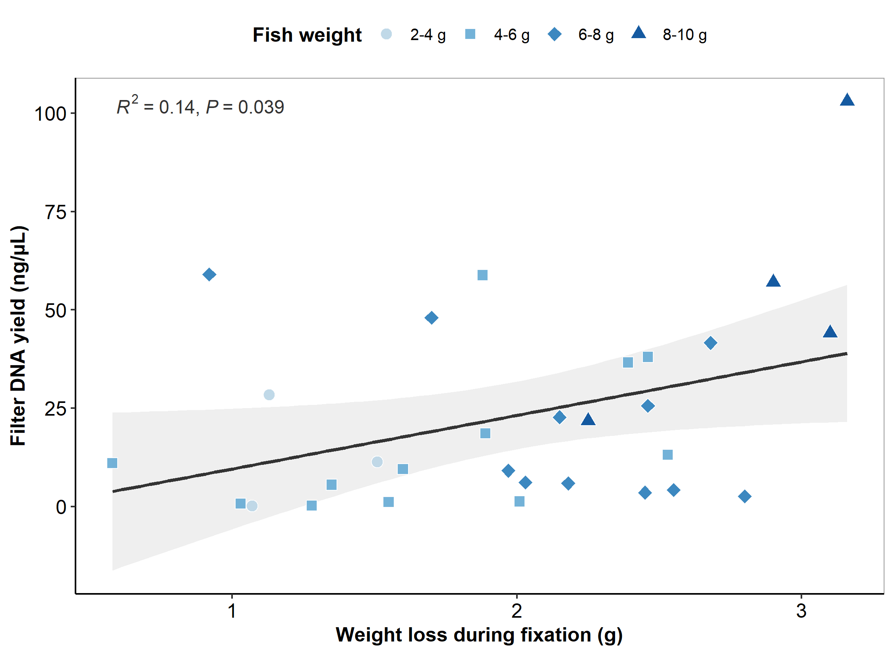<!-- -->

``` r
ggsave(file.path(fig.dir, "Figure_3.png"), fig3,
       width = 7.5, height = 5.5, dpi = 300, bg = "white")
ggsave(file.path(fig.dir, "Figure_3.pdf"), fig3,
       width = 7.5, height = 5.5, device = cairo_pdf, bg = "white")
ggsave(file.path(fig.dir, "Figure_3.tiff"), fig3,
       width = 7.5, height = 5.5, dpi = 300, bg = "white", compression = "lzw")
```

# Analysis 3: Initial Fish Weight Predicts Weight Loss

``` r
data.weight <- data.filter %>% filter(!is.na(fishweightloss))
nrow(data.weight)
```

    ## [1] 30

``` r
model3 <- lm(fishweightloss ~ fishweight, data = data.weight)
summary(model3)
```

    ## 
    ## Call:
    ## lm(formula = fishweightloss ~ fishweight, data = data.weight)
    ## 
    ## Residuals:
    ##     Min      1Q  Median      3Q     Max 
    ## -1.2789 -0.1877  0.1434  0.3004  0.5736 
    ## 
    ## Coefficients:
    ##             Estimate Std. Error t value Pr(>|t|)    
    ## (Intercept)  0.17714    0.33011   0.537    0.596    
    ## fishweight   0.30312    0.05343   5.673 4.42e-06 ***
    ## ---
    ## Signif. codes:  0 '***' 0.001 '**' 0.01 '*' 0.05 '.' 0.1 ' ' 1
    ## 
    ## Residual standard error: 0.4709 on 28 degrees of freedom
    ## Multiple R-squared:  0.5348, Adjusted R-squared:  0.5182 
    ## F-statistic: 32.19 on 1 and 28 DF,  p-value: 4.424e-06

``` r
confint(model3)
```

    ##                  2.5 %    97.5 %
    ## (Intercept) -0.4990642 0.8533509
    ## fishweight   0.1936724 0.4125603

``` r
model3b <- lm(percentage ~ fishweight, data = data.weight)
summary(model3b)
```

    ## 
    ## Call:
    ## lm(formula = percentage ~ fishweight, data = data.weight)
    ## 
    ## Residuals:
    ##     Min      1Q  Median      3Q     Max 
    ## -20.273  -3.496   2.568   5.569   9.571 
    ## 
    ## Coefficients:
    ##             Estimate Std. Error t value Pr(>|t|)    
    ## (Intercept)  36.2843     5.5721   6.512 4.67e-07 ***
    ## fishweight   -0.4693     0.9018  -0.520    0.607    
    ## ---
    ## Signif. codes:  0 '***' 0.001 '**' 0.01 '*' 0.05 '.' 0.1 ' ' 1
    ## 
    ## Residual standard error: 7.949 on 28 degrees of freedom
    ## Multiple R-squared:  0.009578,   Adjusted R-squared:  -0.02579 
    ## F-statistic: 0.2708 on 1 and 28 DF,  p-value: 0.6069

``` r
confint(model3b)
```

    ##                 2.5 %    97.5 %
    ## (Intercept) 24.870386 47.698185
    ## fishweight  -2.316611  1.378059

## Figure 4: Initial Weight vs Weight Loss

``` r
fig4a <- ggplot(data.weight, aes(x = fishweight, y = fishweightloss)) +
  geom_smooth(method = "lm", color = "grey20", fill = "grey75",
              alpha = 0.25, linewidth = 0.9) +
  geom_point(aes(fill = temperature), shape = 21, color = "white",
             stroke = 0.4, size = 3.2, alpha = 0.95) +
  stat_poly_eq(aes(label = paste(after_stat(rr.label),
                                 after_stat(p.value.label), sep = "*\", \"*")),
               formula = y ~ x,
               label.x = "left", label.y = 0.97,
               size = 4, parse = TRUE, label.size = NA, color = "grey20") +
  scale_fill_manual(values = c(room = "#D55E00", fridge = "#0072B2"),
                    labels = c("Room", "Fridge"),
                    name = "Temperature Treatment") +
  labs(x = "Initial fish weight (g)",
       y = "Weight loss during fixation (g)") +
  theme_pubr() +
  theme(legend.position = "top",
        legend.title = element_text(face = "bold"),
        axis.title = element_text(face = "bold"),
        panel.border = element_rect(color = "grey60", fill = NA, linewidth = 0.4))

print(fig4a)
```

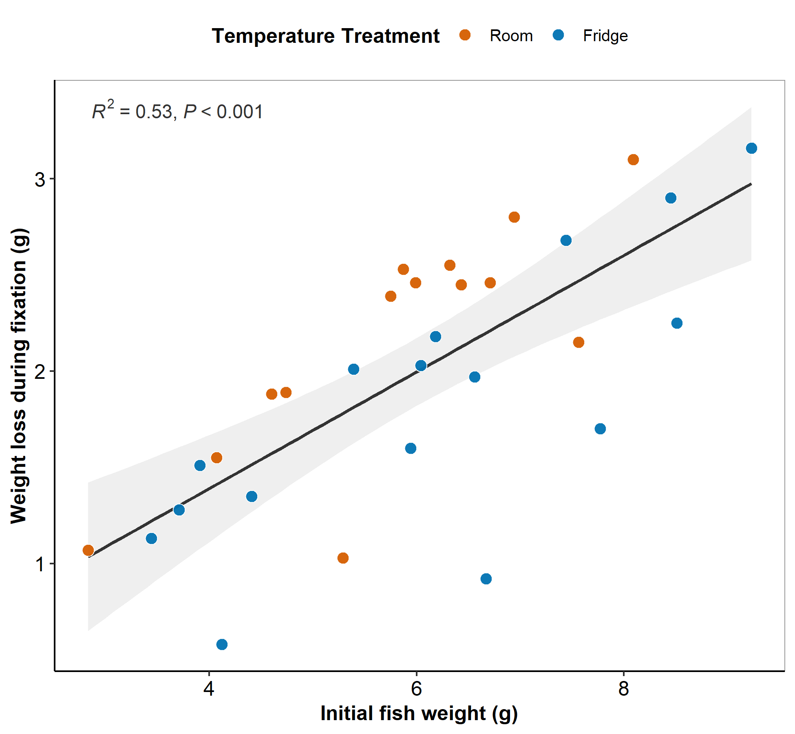<!-- -->

``` r
ggsave(file.path(fig.dir, "Figure_4a.png"), fig4a,
       width = 6.5, height = 6, dpi = 300, bg = "white")
ggsave(file.path(fig.dir, "Figure_4a.pdf"), fig4a,
       width = 6.5, height = 6, device = cairo_pdf, bg = "white")
```

``` r
fig4b <- ggplot(data.weight, aes(x = fishweight, y = percentage)) +
  geom_smooth(method = "lm", color = "grey20", fill = "grey75",
              alpha = 0.25, linewidth = 0.9) +
  geom_point(aes(fill = temperature), shape = 21, color = "white",
             stroke = 0.4, size = 3.2, alpha = 0.95) +
  stat_poly_eq(aes(label = paste(after_stat(rr.label),
                                 after_stat(p.value.label), sep = "*\", \"*")),
               formula = y ~ x,
               label.x = "left", label.y = 0.97,
               size = 4, parse = TRUE, label.size = NA, color = "grey20") +
  scale_fill_manual(values = c(room = "#D55E00", fridge = "#0072B2"),
                    labels = c("Room", "Fridge"),
                    name = "Temperature Treatment") +
  labs(x = "Initial fish weight (g)",
       y = "Percentage weight loss (%)") +
  theme_pubr() +
  theme(legend.position = "top",
        legend.title = element_text(face = "bold"),
        axis.title = element_text(face = "bold"),
        panel.border = element_rect(color = "grey60", fill = NA, linewidth = 0.4))

print(fig4b)
```

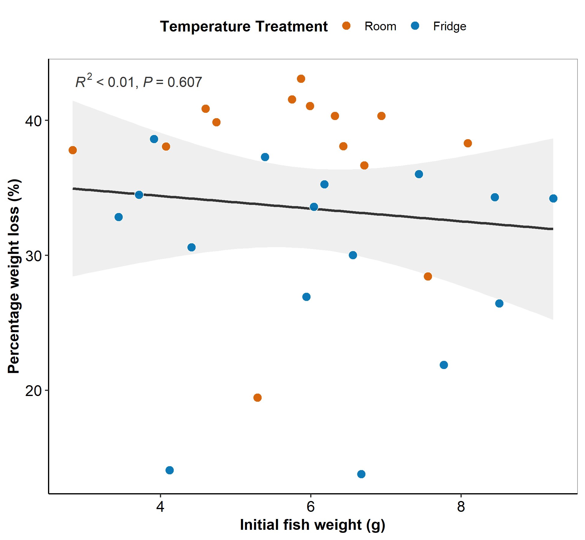<!-- -->

``` r
ggsave(file.path(fig.dir, "Figure_4b.png"), fig4b,
       width = 6.5, height = 6, dpi = 300, bg = "white")
ggsave(file.path(fig.dir, "Figure_4b.pdf"), fig4b,
       width = 6.5, height = 6, device = cairo_pdf, bg = "white")
```

``` r
img_a <- image_read(file.path(fig.dir, "Figure_4a.png"))
img_b <- image_read(file.path(fig.dir, "Figure_4b.png"))

target_h <- max(image_info(img_a)$height, image_info(img_b)$height)

img_a <- image_resize(img_a, paste0("x", target_h))
img_b <- image_resize(img_b, paste0("x", target_h))

img_a <- image_annotate(img_a, "A", location = "+40+20", size = 110,
                        weight = 700, color = "black")
img_b <- image_annotate(img_b, "B", location = "+40+20", size = 110,
                        weight = 700, color = "black")

fig4 <- image_append(c(img_a, img_b), stack = FALSE)

image_write(fig4, file.path(fig.dir, "Figure_4.png"), format = "png")
image_write(fig4, file.path(fig.dir, "Figure_4.pdf"), format = "pdf")
image_write(fig4, file.path(fig.dir, "Figure_4.tiff"), format = "tiff")

fig4
```

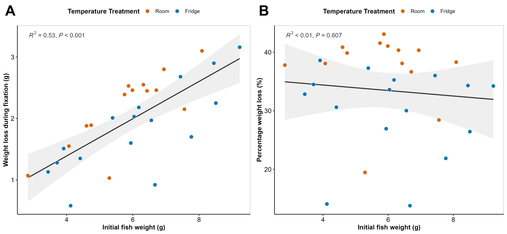
